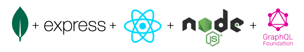

<h1 align="center"> MERN : Book Search Engine </h1>

<p align="center">
  
</p>

<br />
<br />

## Description

The app was built using **MERN stack** functionalities with REACT (frontend), MongoDB (database), Node.js and Express.js for routing. In addition to this full-stack app it features the queries and mutations of **GraphQL API** to replaced the existing RESTful API functionalities.
<br />

- Features:
    - authentication middleware
    - using Apollo provider to communicate with Apollo Server
<br />
<br />

- Deployed Link using Heroku: [Book Search Engine App](https://g-searchengine.herokuapp.com/)
<br />
<br />
<br />

## Table of Contents
1. [Demo](#demo)
    1. [Live url demo](#live-url-demo)
    2. [Overview of the app using Apollo Provider](#overview-of-the-app-using-apollo-provider)
2. [Featured functionalities](#featured-functionalities)
3. [Feedback or Contribute](#feedback-or-contribute)
4. [License](#license)
5. [Reference](#reference)
<br />
<br />

## Demo
```
- Live url in action of the app
- Overview demo using Apollo Provider Sandbox that runs for GraphQL API
```
<br />

#### Live url demo


<br />
<br />

#### Overview of the app using Apollo Provider
<br />
<br />

## Featured functionalities

<details>
<summary>Auth Middleware</summary>

- Using JWT (Json web token)
</details>
<details>
<summary>GraphQL API</summary>

- Using Apollo Server 3 (required to use await server.start before server.applyMiddleware)
- Using Mutation & Query types to setup the API for Apollo Client
</details>
<details>
<summary>Hooks</summary>

- Using useMutation, useState
</details>
<br />
<br />

## Feedback or Contribute
***If you have any feedback or suggestion feel free to send an email,*** codingowl898@gmail.com
<br />
<br />

## License
All rights reserved. Under the 

## Reference
<details>
<summary>Apollo Sandbox</summary>

- https://studio.apollographql.com/sandbox
</details>

<details>
<summary>Documentaries</summary>

- https://reactjs.org/docs/getting-started.html
- https://www.apollographql.com/docs/apollo-server/integrations/middleware/#apollo-server-express
</details>


